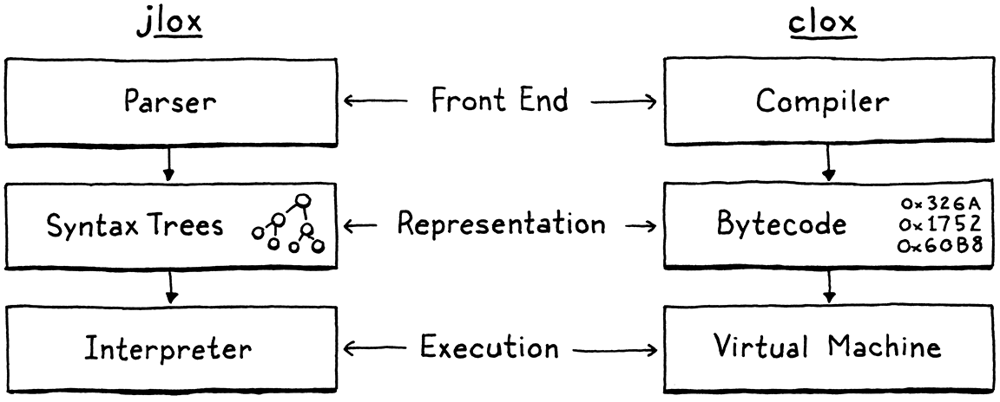

# 요약
bytecode 는 vm 에서 실행할 수 있는 instruction 의 연속체 이다. bytecode 는 machine code 를 흉내낸다.
jlox 에서 파싱 결과 AST 가 생성되었다면 clox 에서는 컴파일 결과 bytecode 가 생성된다.
cpu 는 캐시를 사용하고 기본적인 메카니즘은 메모리의 한 영역을 한번에 캐시에 올린다. 
bytecode 는 AST 에 비해서 조밀하게 메모리에 올라가기 때문에 성능이 훨씬 좋다.
머신코드보다는 속도가 느리지만 bytecode 는 vm 위에서 실행되기 때문에 cpu 아키텍쳐에 대해서 독립적이다. 
vm 을 c 로 작성한다면 c 는 거의 모든 시스템에서도 컴파일이 가능하기 때문에 lox 에 이식성이 생긴다.  
bytecode 의 배열 라인 정보나 값 배열 포함한 한 자료구조를 chunk 로 표현했다.

Remember that whole family of AST classes we defined in jlox? In clox, we’ve reduced that down to three arrays: bytes of code, constant values, and line information for debugging.
This reduction is a key reason why our new interpreter will be faster than jlox.

# 문단별 흥미로운 내용
## Bytecode?
- c 로 컴파일하면 머신코드가 생성된다. 머신 코드는 native instruction의 집합일 것이다. c 런타임은 실제 프로그램을 메모리에 올리는것은 운영체제에 의존할 것이다.
- bytecode: linear sequence of binary instructions.
### Why not walk the AST?
- Whenever the CPU reads a bit of data from RAM, it pulls in a whole little bundle of adjacent bytes and stuffs them in the cache.
- To use the cache effectively, the way we represent code in memory should be dense and ordered like it’s read.
### Why not compile to native code?
- 네이티브코드(머신코드)로 컴파일하는 것이 가장 빠르지만, 그것으로 직접 컴파일 하는것은 어렵고 결과물은 이식성이 없다.
### What is bytecode?

- A tree-walk interpreter is simple, portable, and Slow. native code is complex and platform-specific but fast. Bytecode sits in the middle.
- virtual machine = emulator, vm 은 오버헤드를 가진다. 하지만 vm 를 c 로 쓰면, c 는 모든 하드웨어를 지원함으로 vm 은 포터블 하게 된다.(매번 vm 을 컴파일 해야 하겠지만.) 
- In many bytecode formats, each instruction is only a single byte long, hence “bytecode”.
## Getting Started
## Chunks of Instructions
- "chunk" to refer to sequences of bytecode. 하나의 컴파일 산출물
### A dynamic array of instructions
- 바이트코드는 instruction 의 시리즈이고 동적 배열에 담긴다.
- Dynamic arrays provide
  - Cache-friendly, dense storage
  - Constant-time indexed element lookup
  - Constant-time appending to the end of the array
### Disassembling Chunk
- Lox maintainers will certainly benefit since it(disassembler) gives us a window into the interpreter’s internal representation of code.
- instructions can have different sizes.
```
void disassembleChunk(Chunk* chunk, const char* name) {
  printf("== %s ==\n", name);

  for (int offset = 0; offset < chunk->count;) {
    offset = disassembleInstruction(chunk, offset); // disassembleInstruction 이 다음 offset 을 알려준다.
  }
}

```

### Constants
#### Representing values
- For small fixed-size values like integers, many instruction sets store the value directly in the code stream right after the opcode. These are called **immediate instructions** because the bits for the value are immediately after the opcode.
- That doesn’t work well for large or variable-sized constants like strings. In a native compiler to machine code, those bigger constants get stored in a separate “constant data” region in the binary executable. Then, the instruction to load a constant has an address or offset pointing to where the value is stored in that section.
#### Value arrays
#### Constant instructions

- instruction 이 operand 를 가질 수 있게 할 수 있다. 이는 instruction 행하는 것을 매개변수화 할 수 있도록 해준다. opcode 가 몇 바이트의 operand 를 가질지 결정하며 이 형태를 instruction format 이라고 부른다.   
- 바이트코드 instruction 의 오퍼랜드는 산술 연산자에 전달되는 오퍼랜드와 다른다. 산술 연산의 오퍼랜드 값들은 별도로 추척된다. 바이트코드 명령어의 오퍼랜드는 더 저수준의 개념으로, 해당 바이트코드 명령어의 동작 방식을 변경하는 데 사용한다.
- constants are known at compile time after all
#### Line Information
- 라인 정보를 bytecode 에서 떨어진 별도의 배열에 숫자로 관리하는 단순한 인코딩은 instruction 사이에 존재하면서 cpu 나 캐쉬공간을 차지하면서 캐시미스를 야기하지 않는다는 장점이 있다.


# Design Note
Tests are important in all software, but they’re even more important for a programming language for at least a couple of reasons:
- Users expect their programming languages to be rock solid.
- A language implementation is a deeply interconnected piece of software.
- The input to a language implementation is, by design, combinatorial.
- Language implementations are often complex, constantly changing, and full of optimizations.
end-to-end 언어 테스트를 한다. 각 테스트는 그 언어로 쓰여진 프로그램이고 예상한대로 동작하는지 검증한다. 언어 그자체로 테스트를 작성하는 것은 다음과 같은 장점이 있다.
- 테스트는 외연에 머문다. 인터프리터의 재구성 같은것에 의해서 테스트를 다시 작성할 필요가 없어진다.
- 같은 테스트 세트를, 다른 구현에도 재사용할 수 있다.
- 테스트는 개발한 언어로 작성된 간단한 스크립트이기 때문에 간결하고 읽고 유지보수하기 쉽다.
end-to-end 언어 테스트는 단점도 있다.
- 버그가 있다는걸 알려주기는 하지만, 어디에 있는지 알려주지는 않는다.
- 구현의 모호한 구석을 건디리는 테스트 코드를 작성하는건 성가신 일이 될 수도 있다.
- 테스트 간접비가 높아질수이다. 인터프리터를 실행하고 코드를 동작시키는 일련의 과정을 모두 수행해야 한다. 


upward: 위쪽을 향한
precision: 정확성

