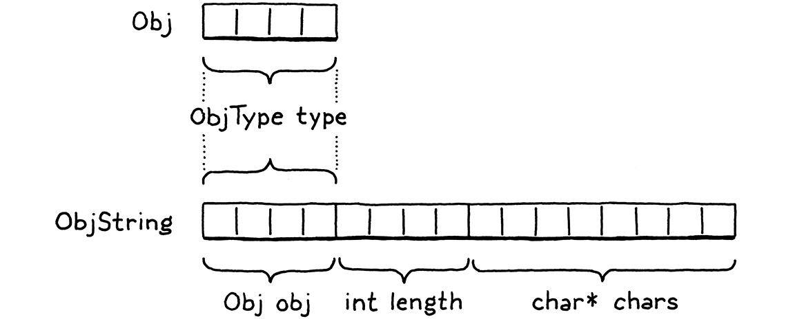

# Strings 요약
크기가 작고 정해진 타입(숫자, 불리언)의 Value 는 페이로드를 Value 구조체 안에 직접 저장하지만, 문자열같은건 그렇게 할 수 없다.
따라서 이런 값들을 표현하기 위한 Object 를 정의하고 Value 가 그것의 포인터를 가지도록 한다. 이로써 Value 는 페이로드로 두 종류를 가지게 된다.
Object 는 String 만 있는게 아니다. Object 와 작동하는 코드는 다형적인 Obj 로 그것을 다루어야 할 필요가 있다. 이를 위해서 Struct Inheritance 라는 테크닉을 사용한다.
String 을 컴파일 하는 코드를 작성한다. ObjString 을 만들 때에는 렉심의 문자열을 복사해서 힙에 저장한다.
String 의 + 연산을 지원하도록 VM 을 수정한다.
힙에 저장되는 Object 를 관리하지 않으면 전형적인 메모리 누수 문제가 발생한다. 이를 위해서 동적으로 할당되는 모든 오브젝트를 추적하는 메카니즘을 링크드 리스트로 구현한다.
이러한 기반은 나중에 추가하기 힘듬으로 첫 번째 오브젝트가 등장한 시점에서 기반을 구축 했다.

# 문단별 흥미로운 내용
## 19.1 Values and Objects
- 우리가 변수에 저장하거나, 표현식에서 계산된 값은 Value 가 된다. 작은 크기가 정해진 타입의(숫자,불리언) 페이로드는 Value 구조체 안에 직접 저장된다.  
  오브젝트가 크다면 그것은 힙에 존재하고 Value 의 페이로드는 메모리상의 바이너리 오브젝트에 대한 포인터(Obj)*가 된다.
## 19.2 Struct Inheritance
- 오브젝트들은 각각 다른 필드를 갖는다. 모든 형태의 오브젝트와 일하는 코드는 다형적인 Obj 로만 오브젝트들을 다루어져야 할 필요가 있다. 
  C 의 구조체는 첫번째 필드부터 정렬이 되도록 되어있어서 ObjString* 을 Obj* 로 캐스트한 뒤 엑세스 할 수 있다.
  →  
## 19.3 Strings
- compiler 에서는 string 함수를 사용해서 Obj 를 가지고 있는 Value 를 chunk 에 emit 한다.
- source 코드의 lexeme 에 대한 포인터를 가지지 않고, 힙에 복사해서 자유롭게 사용하고 '해제' 한다.
- allocateString 를 ObjString* 의 constructor 처럼 활용한다. allocateObject 를 Obj* 의 constructor 처럼 활용한다.
  - allocateObject 호출은 allocateString 로 돌아오고 ObjString* 생성을 완료한다.
## 19.4 Operations on Strings
- copyString 은 인수로 넘어온 chars 의 오너십을 가질 수 있다고 생각하지 않고, 보수적으로 사본을 만든다, takeString 은 인수로 받은걸 가지가 오너십을 가질 수 있다고 생각해서 그대로 ObjString* 를 생성한다.
## 19.5 Freeing Objects
- `"st" + "ri" + "ng"` 를 실행 했을 때, 각각의 상수는 chunk 에 존재한다. 중간 연산인 "stri" 이 만들어지고 최종적으로 "string" 이 stack 에 들어가지만, 중간 연산은 그대로 메모리에 남아있다. 전형적인 메모리 누수 문제다.  
　→　garbage collector 로 이 문제를 해결하지만, 사전작업이 필요하다.

## Challenges
- 3. string 과 다른 타입의 값들에 + 를 지원해서 모두 string 으로 만든다. 많이 사용하는 패턴이다 그래서 많은 언어에서 지원하고 있어어 없다면 오히려 어색하고 불편할 것이다.
