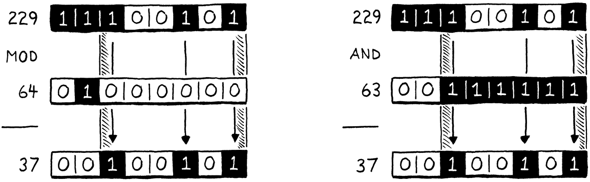

# Optimization 요약

최적화는 프로그램의 성능을 개선하는 것으로,이를 통해 더 적은 리소스를 사용하게 된다.
리소스는 일반적으로 실행 속도지만, 시작시간, 메모리 사용량 같은 것들을 의미할 수도 있다.

최적화가 성능을 개선 했는지 그리고 얼마나 개선했는지 어떻게 검증할 수 있을까? 다른 관련 없는 변경사항들이 성능을 저하시키지 않도록 어떻게 보장할 수 있을까?
이러한 질문에 답하기 위한 프로그램을 "밴치마크" 라고 부른다.
전체 벤치마크 모음을 확보하면, 최적화가 성능을 변화시킨다는 사실뿐만 아니라 어떤 종류의 코드에서 그런 변화가 발생하는지까지 측정할 수 있다.
(실제의 사용을 제대로 반영하지 못하는 벤치마크도 있다. 이런 경우 실제 사용이 아닌 벤치마크에 vm 을 최적화 하는 아이러니한 상황이 발생한다.)

프로파일러는 프로그램을 실행하고 코드가 실행되는동안 하드웨어 리소스 사용량을 추적하는 도구이다.
간단한 것으로는 프로그램의 각 함수가 얼마나 시간을 사용하는지 보여준다.

제수가 2의 거듭제곱일 경우, 피제수와 제수를 2진수로 표현했을 때, 피제수에서 제수의 최상이비트 이상은 나누어떨어지는 수이고, 나머지 비트가 모듈로 연산의 결과가 된다.
이는 제수 -1 과 피제수의 AND 연산과 같다. 그리고 capacity 는 8로 시작해서 2배씩 증가하는 2의 거듭제곱이다.
이 사실을 이용하면 모듈로 연산을 훨씬 빠른 AND 연산으로 대체할 수 있다. 다시 벤치마크를 수행해서 성능이 개선된 것을 확인한다.

NaN 박싱 기법을 사용해서 값의 크기를 감소시켜 캐시 친화적으로 만드는 것으로 성능을 개선한다.
NaN 박싱은 VM 에서 사용하는 가장 큰 값 타입인 더블을 기준으로 나머지 다른 타입의 값들을 NaN 의 비트 패턴으로 인코딩 하는 방법이다.
NaN 박싱을 통한 성능 개선은 전체적으로 조금씩 개선된 것으로, 큰 프로그램에서 그 효과를 확인할 수 있음으로 검증하기가 힘들다.
검증을 위해서는 더 큰 벤치마크 모음이 필요하다. 

# 문단별 흥미로운 내용

## 30.1 Measuring Performance
- Optimization 은 동작하는 어플리케이션의 성능을 개선하는 것으로 이를 통해 더 적은 리소스를 사용하게 된다.
### 30.1.1 Benchmarks
- Benchmarks 는 언어 구현체의 성능을 측정하기 위한 프로그램이다.
- Remember, the ultimate goal is to make user programs faster, and benchmarks are only a proxy for that.
### 30.1.2 Profiling
- Profiler 는 코드가 실행될 때 하드웨어 자원 사용을 추적하는 프로그램이다.

## 30.2 Faster Hash Table Probing
- profiler 를 통해서 tableGet 의 실행에 가장 많은 시간이 사용된다는 것을 발견했다.
### 30.2.1 Slow key wrapping
- Bitmasking 은 정수의 비트(0/1)를 “플래그 집합”처럼 써서, 여러 개의 ON/OFF 상태를 하나의 값에 압축해서 저장·조회·수정하는 기법.

- 제수가 2의 거듭제곱일때, 제수와, 피제수를 2진수로 표현 해 보면, 제수의 최상위 비트 이상의 피제수의 비트들은 나누어 떨어지는 수들이다.
※ 특정 제약사항을 통해서 최적화가 가능해 진다.

## 30.3 NaN Boxing
- NaN Boxing(NaN tagging) 은, 인터프리터가 다루는 값중 가장 큰 타입인 더블에 맞춰서, NaN 의 남는 비트 패턴에 다른 타압의 값들을 인코딩 하는 기법이다. 
  이를 통해 값의 크기가 작아지고 캐시에 더 많은 값들을 넣을 수 있게 되어서 성능이 향상된다.    
### 30.3.1 What is(and is not) a number?
- But, fortunately, our VM hides all of the mechanism to go from values to raw types behind a handful of macros. 
  Rewrite those to implement NaN boxing, and the rest of the VM should just work. → Value 타입 자체가 64bit 이 되고, Value 생성 리턴등의 메크로가 변경된다?
### 30.3.2 Conditional support
- NAN_BOXING 플래그럴 설정하는걸로 NaN-Boxing 과 기존 타입 테그드 값 타임 모두를 지원하도록 한다.NAN_BOXING 모드에서 Value 는 uint64_t 로 정의한다. double 로 정의하는 방법도 있지만, 이 타입이 비트 연산을 하기 편하다.
### 30.3.3 Numbers
### 30.3.4 Nil, true, and false
### 30.3.5 Objects
### 30.3.6 Value functions
- 스펙을 준수하면 NaN == NaN → false 가 되어야 한다. 아무도 신경쓰지 않는 이 스펙을 준수하기 위해서 성능상의 희생이 필요할 수 있다.
  - JAVA 에서 primitive double 은 이 스펙대로 구현되어 있지만, 박싱한 객체타입의 Double.equals 를 사용하면 true 를 리턴한다.
### 30.3.7 Evaluating Performance
- NaN Boxing 의 퍼포먼스 향상을 평가하는건, 프로파일러로 핫스팟을 찾아서 개선하는 것과 다르게 쉽지 않다. 이런류의 개선을 검증하기 위해서는 큰 벤치마크 스위트가 필요하다.

## 30.4 Where to Next
- 어떤 분야에서 일하던, 프로그래밍 언어에 대한 메타지식과, 직접 언어를 구현하면서 fundamental data structures 에 대해 공부한것은 도움이 된다. (AST, Table 등..)
- One of my favorite aspects of software engineering is how much it rewards those with eclectic interests.
- 우리가 컴파일러와 인터프리터스를 구현 해 온 것 처럼, 정말 어려운 내용도 한걸음식 해결할 수 있다.

## Challenges
- 3. 이 책에서 하양식, 상향식 어떤 접근이 더 이해하기 쉬웠나? 비유가 있는편이 좋았나 아니었나. 자신의 학습 스타일을 이해하는 시간을 가져라. 이를 통해 배울 자료를 구체적으로 선택할 수 있다. 