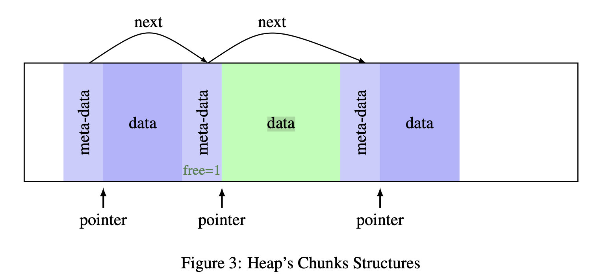
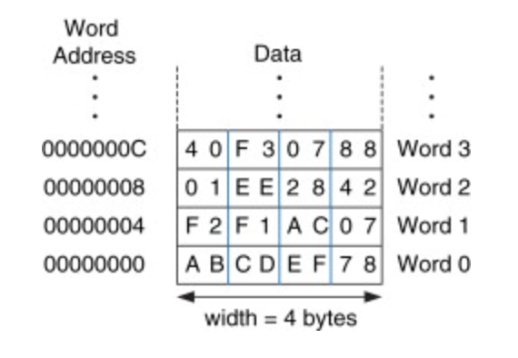
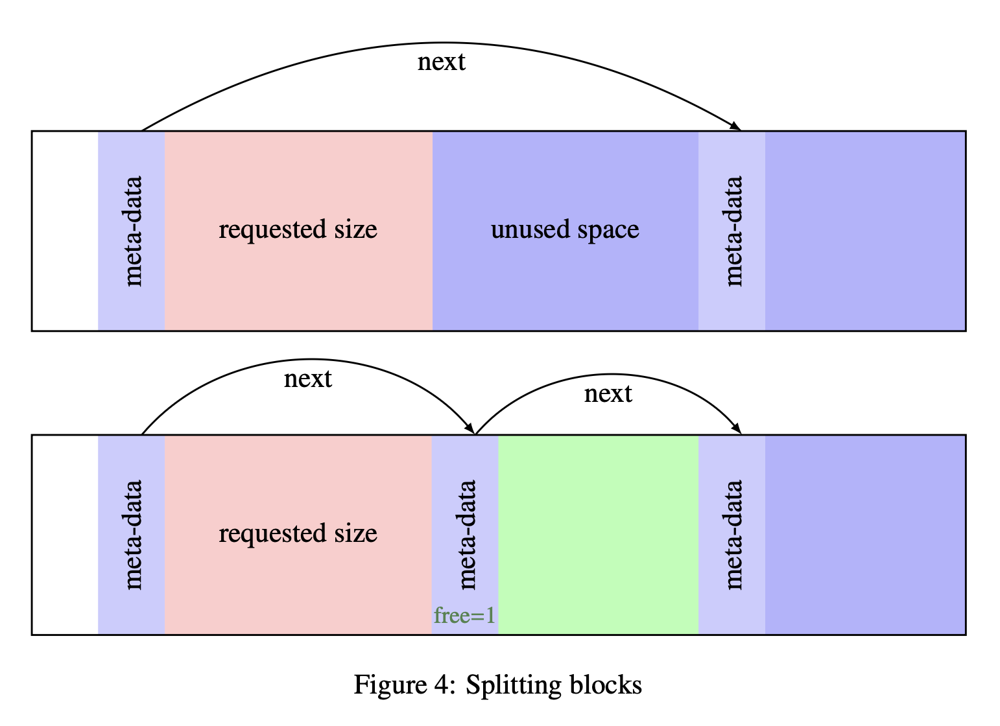

# Introduction

메모리가 어떻게 관리되는지 이해하기 위해 나이브한 malloc 을 직접 구현해 본다.
malloc 의 요구사항은 다음과 같다.

- malloc은 요청한 바이트 수 이상을 할당해야 한다.
- malloc이 반환한 포인터는 읽기 및 쓰기가 가능한 할당된 공간을 가리켜야 한다.
- 동일한 공간이나 그 일부가, 포인터가 free 되지 않는 한, 다른 malloc 호출에 의해 다시 할당되어서는 안 된다. (메모리 안정성을 위해서)
- malloc은 실행 시간이 지나치게 오래 걸려서는 안 된다 (NP-hard 문제가 되어서는 안 됨).
- malloc은 메모리의 크기 조정(realloc)과 해제(free) 기능도 지원해야 한다.

# The Heap and the brk and sbrk syscalls

brk, sbrk 는 리눅스의 syscall 이다.

- int void * brk ( const void * addr ) : 힙의 break 를 addr 로 이동시킨다.
- sbrk ( intptr_t incr ) : 힙을 increment 만큼 증가 시킨다음 시스템에 따라서 새로운 break 또는 이전 break 를 되돌려준다. 어떤 시스템이든 sbrk(0) 을 하면 현재 break 주소를 얻을 수 있다.

# Dummy malloc

실용적이지 않지만 가장 간단한 구현은 다음과 같다. sbrk(0) 호출로 직전 break 주소를 확보하고, 다시 sbrk(size) 호출로 break 를 이동시킨다. 실패하면 null 을 돌려준다.
free 그리고 realloc 는 불가능하다.

```c
/* An horrible dummy malloc */

#include <sys/ types .h>
#include <unistd .h>

void * malloc ( size_t size )
{
 void *p;
 p = sbrk (0);
 /* If sbrk fails , we return NULL */
 if ( sbrk ( size ) == ( void *) -1)
 return NULL ;
 return p;
}
```

# Organizing the Heap

dummy malloc 은 모든 요구사항을 만족시키지 못한다. 보다 효율적이고 free 와 realloc 를 지원 할 수 있는 heap 의 조직화 방법을 모색한다.
메모리를 클라이언트가 원하는 만큼 할당하고, 해제하고 다시 할당하기 위해서는, 할당된 메모리에 다음과 같은 추가적인 정보가 필요하다.

- 청크의 사이즈
- 다음 청크의 주소
- 사용중인지 아닌지    



블록정보 (힙이 어떻게 나누어졌는지, 일종의 메타 데이터)는 다음과 같은 c 코드로 표현될 수 있다.

```c
typedef struct s_block *t_block;

struct s_block {
   size_t   size;
   t_block  next;
   int      free;
};
```

※ 포인터에 타입이 있는 이유는 포인터 산술 연산 같은걸 지원하기 위함이다. int *p; // int는 보통 4바이트 p + 1 은 4바이트 뒤의 주소를 가르킨다.
이제 t_block 타입을 사용한다. malloc 이 없는데 struct 를 만들 수 있을까? 메모리에서 struct 는 그것의 필드의 연속이다.
s_block 은 각각의 필드가 4byte 임으로 총 12byte 이다. p->free 와 같은 struct 의 표현은 단지 포인터 산술의 구문 설탕이다. p->free 는 *((char*)p+8)) 가 된다.
따라서 필요한 크기이 메모리를 sbrk 로 할당하는 것으로 struct 를 사용할 수 있다.

```c
/* Example of using t_block without malloc */
t_block b;
/* save the old break in b */
b = sbrk (0);
/* add the needed space /* size is the parameter of malloc */
*/
sbrk ( sizeof ( struct s_block ) + size );
b-> size = size ;
/* ... */
```

# A First Fit Malloc

first fit 알고리즘을 사용한 malloc 을 구현한다. 알고리즘은 요청된 크기의 할당을 수용할 블복을 찾을때까지 청크 리스트를 순회하는 것이다.

## Aligned Pointers

 
포인터는 Integer 크기로 정렬할 필요가 있다. 32bit 환경에서는 기본 데이터 단위가 4바이트(32bit)이다. 메타 데이터 블록은 이미 4의 배수임으로 데이터 블록의 크기를 정렬하기 위해서
항상 4의 배수를 되돌려 주는 다음과 같은 메크로를 사용한다.
`# define align4 (x) ((((( x) -1) > >2) < <2)+4)`  


## Finding a chunk: the First Fit Algorithm

base 부터 조건이 맞는 chunk 를 찾아서 순회한다.

```c
// t_block *last 는 t_block(구조체의 포인터) 를 가르키는 포인터 타입, 외부의 변수를 함수 내부에서 수정한다.   
t_block find_block(t_block *last, size_t size) {
    t_block b = base;
    while (b && !(b->free && b->size >= size)) { // last 는 b 가 아니라 마지막으로 사용중인 블럭을 가르킨다.     
        *last = b;                 
        b = b-> next;           
    }
    return (b);
}
```

## Extending the heap

`#define BLOCK_SIZE sizeof(struct s_block)`
sbrk를 사용해서 메타데이터사이즈 + 요구된 사이즈 만큼 힙을 확장시킨다. last 블록이 있다면, last->next 에 새 블록을 연결한다.

```c
t_block extend_heap(t_block last, size_t s) {
    t_block b;
    b = sbrk(0); //현재 heap 의 break point 주소 
    if (sbrk(BLOCK_SIZE + s) == (void*)-1) 
        /* sbrk fails , go to die */
        return (NULL);
    b->size = s;
    b->next = NULL;
    if(last)
        last->next = b;
    b->free = 0;
    return (b);
}
```

## Splitting blocks

블록을 나누어서 힙 공간의 낭비를 줄인다.  


이를 위해서 새로운 필드인 실 데이터의 시작부분이 되는 `char data[1]` 를 추가한다.

```c
struct s_block {
   size_t   size;
   t_block  next;
   int      free;
   char     data[1]; // 이 베열의 포인터는 메타 데이터의 끝, 실제 데이터의 시작을 나타낸다.
};

/* Of course , update the BLOCK_SIZE macro */
# define BLOCK_SIZE 12 /* 3*4 ... */   // data[1] 는 실제 데이터에 속하는 영역임으로, 블록 사이즈 자체는 12로 변하지 않는다.
```

```c
void split_block(t_block b, size_t s) {
    t_block new;
    new = b->data + s; // 새로운 블록의 시작부분을 나타내는 포인터, data 는 char[] 의 포인터이기 때문에 byte 의 포인터 연산이 된다. 
    new->size = b->size - s - BLOCK_SIZE;
    new->next = b->next;
    new->free = 1;
    b->size = s
    b->next = new;
}
```

## The malloc function

malloc 은 우리가 구현한 함수들의 wrapper 이다.
먼저 find block 에서 사용되는 전역변수는 다음과 같이 초기화 된다. `void *base=NULL;`
malloc 은 일단 이 base 가 null 인지를 즉 처음 malloc 을 호출하는지를 테스트 한다.
malloc 은 다음과 같이 동작한다.

- 요청된 크기를 정렬한다.
- base 가 초기화 되었다면,
    - 충분히 넓은 빈 청크를 찾는다.
    - 청크를 찾았다면,
        - split 을 시도한다. (요청된 사이즈와 기존 블록 사이즈의 차는, 메타데이터(12바이트)와 가장작은 실데이터 단위(4바이트) 를 더한 값보다 크거나 같아야 한다.)
        - 청크를 사용중으로 표시한다.
    - 청크를 찾지 못했다면 힙을 확장한다. find_block 함수는 마지막으로 방문했던 chunk 에 대한 포인터를 last 해 할당한다. 따라서 다시 리스트를 순회할 필요가 없다.
- base 가 초기화 되어있지 않다면, 힙을 확장한다.

요구사항에 정의되어있는대로 실패한다면 null 을 리턴한다.
※void*: 타입이 정해지지 않은 포인터

```c
void *malloc(size_t size) {
    t_block b, last;
    size_t s;
    s = align4(size) // 4 바이트의 배수 
    if (base) {
        /* First find a block */
        last = base;
        b = find_block(&last, s);
        if (b) {
            /* can we split */
            if ((b->size - s) >= (BLOCK_SIZE +4))
                split_block(b, s);
            b-> free=0;
        } else {
            /& No fitting block, extend the heap */
            b = extend_heap(last, s);
            if (!b)
                return (NULL);
        }
    } else {
        /* first time */
        b = extend_heap(NULL, s);
        if (!b)
            return (NULL);
        base = b;
    }
    return(b->data);
}
```

# calloc, free and realloc

## calloc

calloc 은 오브젝트 가각의 크기 size 의 number 개 만큼의 메모리를 할당하고 모든 바이트공간은 0 으로 초기화 한다.

```c
void *calloc(size_t number, size_t size) {
    size_t *new;
    size_t s4,i;
    new = malloc(number * size);
    if (new) {
      s4 = align4(number * size) >> 2; // 자료에는 << 로 되어있으나 >> 가 맞는것 같음
      for (i=0; i<s4; i++)
        new[i] = 0;
    }
    return(new);
}
```

## free

### Fragmentation: the malloc illness
spilt 을 사용하기 때문에 메모리 공간이 계속해서 조각난다. 이를 해결하기 위해서 free 를 호출할 때 이웃하는 chunk 를 합친다.
```c
t_block fusion(t_block b) {
    if (b->next && b->next->free) {
      b->size += BLOCK_SIZE + b->next->size;
      b->next = b->next->next;
      if (b->next)
        b->next->prev=b;
    }
    return(b);
}
```
### Finding the right chunk
malloc 이 리턴한 포인터를 가지고 해당 메모리 블록을 다시 찾을 때 다음과 같은 문제가 있다.
- 포인터가 malloc 이 되돌려준 포인터가 맞는지 확인해야 한다.
- malloc 은 실제 데이터부의 포인터를 되돌려주기 때문에 메타데이터의 포인터를 찾아야 한다.
이를 자기참조용 필드 ptr 추가와, get_block 으로 해결할 수 있다.
b->ptr == b->data
```c
struct s_block {
    size_t          size;
    struct s_block  *next;
    struct s_block  *prev;
    int             free;
    void            *ptr;       // data 필드를 사용할수 있지만, 명시적으로 포인터를 선언
    char            data[1];
}
tpyedef struct s_block *t_block;

// 메타데이터의 시작 주소 리턴
/* Get the block from and addr */
t_block get_block(void *p) {
    char *tmp;
    tmp = p;
    return(p = tmp -= BLOCK_SIZE);
}

/* Valid addr for free */
int valid_addr(void *p) {
    if (base) {
        if (p>base && p<sbrk(0)) {
            return(p == (get_block(p))->ptr);
        }
    }
    return (0);
}
```
### The free function

```c
/* The free */
void free(void *p) {
    t_block b;
    if (valid_addr(p)) {
        b = get_block(p);
        b->free = 1;
        
        /* fusion with previous if possible */
        if (b->prev && b->prev->free) {
            b = fusion(b->prev);
        }
        
        /* then fusion with next */
        if (b->next) {
            fusion(b);
        } else {
             /* free the end of the heap */
             if (b->prev)
                b->prev->next = NULL;
             else 
                base = NULL;
             brk(b);
        } 
    }
} 
```

## Resizing chunks with realloc
realloc 은 다음과 같은 알고리즘을 가진다.
- malloc 을 사용해서 새로운 블락을 할당한다.
- 데이터를 카피한다.
- 이전 블락을 해제한다.
- 새로운 블락의 데이터부의 포인터를 돌려준다.
realloc(NULL, s) 는 malloc(s) 로 대체 될수 있어야 한다.
```c
/* Copy data from block to block */
void copy_block(t_block src, t_block dst) {
    int     *sdata, *ddata;
    size_t  i;
    sdata = src->ptr;
    ddata = dst->ptr;
    for(i=0; i*4 < src->size && i*4 < dst->size; i++) {
        ddata[i] = sdata[i]
    }
}
```

```c
/* The realloc */
void *realloc(void *p, size_t size) {
    size_t      s;
    t_block     b, new;
    void        *newp;
    
    if (!p)
        return (malloc(size));
    if (valid_addr(p)) {
        s = align4(size);
        b = get_block(p);
        if (b->size >= s) {
            if (b->size - s >= (BLOCK_SIZE + 4)) {
                split_block(b, s);   
            }
        } else {
            /* Try fusion with next if possible */
            if (b->next && b->next->free && (b->size + BLOCK_SIZE + b->next->size) >= s) {
                fusion(b);
                if (b->size - s >= (BLOCK_SIZE + 4))
                    split_block(b, s);
            } else {
                /* good old realloc with a new block */
                newp = malloc(s);
                if (!newp)
                    return(NULL);
                new = get_block(newp);
                copy_block(b, new);
                free(p);
                return (newp);
            }
        }
        return(p);
    }
    return(NULL);
}
```
### FreeBSD's realloc
FreeBSD 에서 제공하는 reallocf 는 인수로 받은 포인터를 무조건 해제한다.
/* See reallocf(3) */
```c
void *reallocf(void *p, size_t size) {
    void *newp;
    newp = realloc(p, size);
    if(!newp)
        free(p);
    return newp;
}
```

## Putting things together

```c
/* block struct */
struct s_block {
    size_t          size;
    struct s_block *next;
    struct s_block *prev;
    int             free;
    void           *ptr;
    char            data[1];
};
typedef struct s_block *t_block;

#define BLOCK_SIZE 20 // data 필드를 제외 5*4byte

void split_block(t_block b, size_t s) {
    t_block     new;
    new = (t_block)(b->data + s); // b의 데이터부의 포인터에서 s 만큼 이동한 위치가 split 으로 새로 생기는 블록의 시작 위치가 된다. 
    new->size = b->size - s - BLOCK_SIZE;
    new->next = b->next;
    new->prev = s;
    new->free = 1;
    new->ptr = new->data // new 에 주소가 할당되면, new->data 는 20 바이트 후의 주소가 된다.  
    b->size = s;
    b->next = new;
    if (new->next)
        new->next->prev = new;
}

t_block extend_heap(t_block last, size_t s) {
    int     sb;
    t_block b;
    b = sbrk(0);
    sb = (int)sbrk(BLOCK_SIZE + s);
    if (sb < 0)
        return (NULL);
    b->size = s;
    b->next = NULL;
    b->prev = last;
    b->ptr = b->data;
    if (last)
        last->next = b;
    b->free = 0;
    return(b);
}

```
