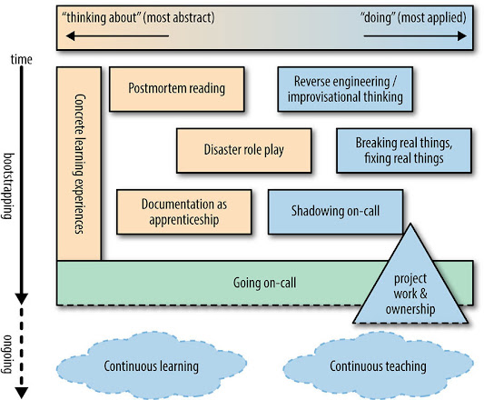

# Accelerating SREs to On-Call and Beyond 
(How Can I Strap a Jetpack to My Newbies While Keeping Senior SREs Up to Speed?)

## You've Hired Your Next SRE(s), Now What?
신입이 온콜러로 일하려면 어떤게 필요할까를 넘어서,
온콜을 할 수 있는지 어떻게 평가할 것인가, 어떻게 교육을 설계해야 교육 활동자체가 팀원들에게 인센티브를 가질까를 생각해야 한다.
사람들의 학습 스타일에 대한 선호는 다향함으로 한가지 스타일을 고수하는 것은 비효율 적이다.
신입을 온콜러로 만들기 위한 모범사례를 다음과 같은 청사진으로 시각화 할 수 있다.

_A blueprint for bootstrapping an SRE to on-call and beyond_  

## Initial Learning Experiences: The Case for Structure Over Chaos
티켓을 사용한 "trial by fire" 방식은 반응적인 행동만을 교육함으로 SRE 교육에 적합하지 않다.
SRE의 기본 철학인 사전 대책을 강구하는 태도는 교육에도 반영되어야 한다. 따라서 구조화된 교육이 제공 되어야 한다.

### Learning Paths That Are Cumulative and Orderly (누적되고 순서가있는 학습과정)
학습자가 전체 학습과정을 볼 수 있도록 해야 한다. 이론과 응용을 적절히 조합해야 하며,
추상적인 개념은 학습의 앞쪽에 위치해야 한다. 학습을 어떻게 표현할 것인지는 팀에 따라 다르지만 체크리스트를 활용할 수 도 있다.
이 표현은 구체적인 학습내용은 아니지만, 누구에게 질문을 할 수 있을지, 유용한 문서는 무엇인지, 학습한 결과 무엇을 얻게되는지,
실제로 지식을 습득하지 않으면 답변할 수 없는 질문이 포함되어 있다.
이해관계자가 학습자가 어느정도 지식을 획득했는지 알수 있는 피드백 장치가 있는게 중요하다.
어떤 공식적인 시험의 형태가 아닌 숙제의 형태여도 좋고 이를 통해서, 학습과정을 관리할 수 있다.   

### Targeted Project Work, Not Menial Work
사소한 작업이 아닌 목표가 있는 출발자의 프로젝트를 함으로,주인의식을 느낄 수 있게 하는 것은 학습 효율을 올린다.
출발자 프로젝트는 전체 인프라를 둘러볼 수 있어야하고, 학습만 하고 있으면 얻을 수 없는 목적의식과 생산에 관한 감각을 얻을 수 있다.
출발자 프로젝트의 패턴은 다음과 같다. 
- 유저가 볼수 있는 사소한 변경을 프러덕션까지 릴리즈하기. 이를 통해서 개발 툴체인과 릴리즈 프로세스를 이해할 수 있다.
- 모니터링 지점 추가하기. 모니터링 로직을 이해할 수 있다.
- 충분히 귀찮치 않아서 아직 자동화되지 않은 프로세스의 자동화. 수고스러운 일을 덜어내는 것에 대한 공감을 자아낼 수 있다.

## Creating Stellar Reverse Engineering and Improvisational Thinker
어떤 SRE를 만들고 싶은가가 가장 중요하다. SRE는 다음과 같은 특성을 갖추어야 한다.
- 리버스 엔지니어링 스킬
- 통계적 사고
- 임기응변 능력

### Reverse Engineers: Figuring Out How Things Work
리버스 엔지니어링 능력은 복잡한 시스템에서 예상치 못한 문제를 효율적으로 발견할 수 있다.
시스템의 표면에 나타나는 정보들로 추론을 도출하는 연습을 해야 한다. 

### Statistical and Comparative Thinkers: Stewards of the Scientific Method Under Pressure
(통계 및 비교 사고가: 압박속에서 과학적 방법을 고수하는 자.)
대규모 시스템에서 사고에 대한 대응은 의사결정 트리를 탐색하는 것과 같다.
SRE는 의사결정 트리를 효과적으로 탐색해야 함으로 통계 및 비교 사고를 할 수 있어야 한다.
따라서 좋은 분석가 및 비교가 될 수 있도록 초기부터 교육해야 한다.

### Improv Artists: When the Unexpected Happens
(임기응변 예술가: 예상하하지 못한 일이 일어났을 때.)
해결책을 시도 했을때 그것이 효과가 없는경우, 임기응변으로 대응할 수 있어야 한다.
절차에 집중하다보면 분석적 사고방법을 잊을 수 도 있다.
SRE에게 다양한 분석적 함정을 보여주고, 필요하다면 한발 물러서서 다른 접근방식을 찾아보는게 중요하다는 것을 교육해야 한다.

### Tying This Together: Reverse Engineering a Production Service
Production Service 에 대한 리버스엔지니어링 위의 모든 특성을 교육할 수 있는 연습이다.
이 연습의 핵심은 학생이 먼저 리버스엔지니어링을 통해 시스템을 파악하고, 멘토가 이에대한 피드백을 주는 것 이다.

특정 서비스의 팀 전체가 연락을 취할 수 없어서, 이 세션의 학생이 그 서비스를 동작하게 할 책임이 생겼다고 가정하는 것으로 시작한다.
핵생은 서빙 스택이 엔드투 엔드에서 어떻게 동작해야하는지 파악해야 한다.
이 시나리오에서 학생은 고도로 계측가능한 시스템의 모니터링을 통해서 사용자의 쿼리가 어떻게 이동하는지 파악하고 이를 바탕으로 시스템 다이어그램을 그린다.
이 시스템 다이어그램은 멘토에게 발표되며, 이해에 대한 구멍은 멘토에 의해서 매워지게 된다.

## Five Practice for Aspiring On-Callers (차기 온콜러를 위한 다섯가지 연습)
On-Call이 가능하게 되는것 자체가 SRE의 가장 중요한 목적은 아니지만, 이것이 가능하다는 것은 시스템에 대해서 넓고 깊게 이해하고 있다는 것이다.

### A Hunger for Failure: Reading and Sharing Postmortems
구조적이거나 신기한 장애에 대한 사후조서는 교육자료로 유용하다. 뉴비들은 이를 통해 인식도와 온콜 대응에 대한 이해를 가질 수 있다.
교육용으로 적절한 사후조서를 약간에 편집을 거쳐서 쉽게 접근할 수도 있도록 해야 한다. 사후조서에 대해 논의하는 모임이 있으면 좋다.

### Disaster Role Playing
장애상황에 대응하는 롤플레잉을 통해 뉴비에게 SRE문화에 대한 인상을 심어주고, 베테랑에게는 스택의 변경과 기능에 대해서 알릴 수 있다.
롤플레잉의 시나리오는 뉴비가 경험하지 못했거나, 아니면 베테랑이 잊어버렸을 법한 옛날의 장애 상황, 또는 곧 출시될 기능에 대한 것 일수도 있다.
롤플레잉을 통해 문제 해결방법의 다른관점, 요령, 아니면 이 문제에 대처할 수 있었을 것이라는 검증을 얻을 수 있다.

### Break Real Things, Fix Real Things
on call 에 들어가기 전에 실제 프러덕션 시스템을 고치는 경험을 제공하는 것은 유용하다.
프러덕션 시스템에서 일부 인스턴스를 빌려오거나 staging 환경을 사용할 수 있고,
리스크가 없는 환경에서, 시니어 SRE가 시스템을 손상시키고 뉴비가 그것을 고치도록 할 수 있다.
또는, 팀으로 시스템의 특정 부분을 손상시켰을 때 나타날 시스템의 반응을 미치 예측하고 추론한 다음,
실제로 일어난 일과 비교해서 예측을 검증하고 추론이 맞았음을 입증할 수 도 있다.
이러한 연습에서 시스템은 예상한것 만큼 부드럽게 저하되지 않음으로 수정해야할 버그들을 추려낼 수 있다.

### Documentation as Apprenticeship (수습으로써의 문서화)
뉴비 교육을 위한 체크리스트는 뉴비에게는 학습의 이정표를, 멘토에게는 뉴비가 무엇을 얼마나 알고있는지에 대한 정보를 제공한다.
체크리스트는 반드시 내재화 되어야하며, 뉴비가 체크리스트를 숙달하게 되면 on-call 가능하다는 계약을 의미하게된다.
문서는 흔히 out dated 됨으로, 뉴비가 팀에 들어왔을 때, 체크리스트를 검토하고 가장 out dated 된 문서를 뉴비가 점검 하도록 할 수 있다.
체크리스트에는 항상 해당 항목의 전문가의 연락처가 있음으로 뉴비는 이른 타이밍에 이 전문가와의 관계를 만들 수 있고,
나중에 이 전문가의 리뷰하에 문서를 수정할 수도 있다.

### Shadow On-Call Early and Often
이론적인 연습을 백날 하는걸로는 온콜을 완전히 준비할 수 없다.
결국 직접 장애를 경험하고 해결해야하지만 그때까지 뉴비가 그것을 경험하지 못하는 것은 아니다.
뉴비가 체크리스트 같은 기초 학습을 모두 마쳤을 경우, 호출 시스템에 뉴비도 호출하도록 설정하라.
쉐도우 온콜러로 활약하는 것으로써 온콜이 어떤 것인지 가시성을 갖게될 것이다.
실제 온콜러가 장애를 해결하는 과정을 가장 앞에서 지켜볼 수 있고, 
장애 처리작업을 마친 후에 온콜러가 뉴비의 추론과 프로세스를 검토하고 피드백을 주는것은, 뉴비에 기억에 오래남는 효율적인 연습이다.

## On-Call and Beyond: Rites of Passage, and Practicing Continuing Education
완료된 체크리스트의 제출 또는 시험이 on-call 투입의 통과의례가 될 수 있다.
스택은 계속해서 변경됨으로 학습은 계속 되어야 하며, 프레젠테이션을 가지는게 한가지 방법이 될 수 있다.
프레젠테이션의 대상은 동료 SRE 또는 개발자가 될 수 있으며, 이러한 참여를 통해, 
이후 개발자와 SRE 간의 정보교환의 효율성이 증가한다.

## Closing Thoughts
SRE 교육은 학생과 팀 모두에게 큰 가치가 있다.
이 장에서 소개한 응용할 수 있는 사례를 적용하면 역량있는 SRE를 빠르게 육성하고, 팀의 스킬을 지속적으로 연마할 수 있다.
결론은 SRE는 머신을 확장하는 것보다 사람을 더 빨리 확장해야 한다는 것이다.

# Summary
on-call 에 투입할 수 있는 엔지니어는 시스템에 대해서 넓고 깊게 이해하고 있는 엔지니어이다.
따라서 구글은 on-call 에 투입될 수 있도록 교육을 한다.
교육은 주먹구구식이 아닌 단계적이고 점진적으로 지식을 습득할 수 있도록 설계된 교육이어야 한다.
SREs 에게 요구되는 능력인 리버스엔지니어링, 통계적사고, 임기응변 을 갖추기 위한 교육을 제공한다.   
교육에 있어서 다음과 같은 다섯가지 실천법이 있다.
- 포스트모템 공유
- 재난 롤플레잉
- 실제로 부수고 고치기
- 문서화 참여
- 쉐도우 온콜 
이러한 교육과정을 통해서 시니어와 뉴비는 모두 신뢰 및 지식을 쌓을 수 있다.
