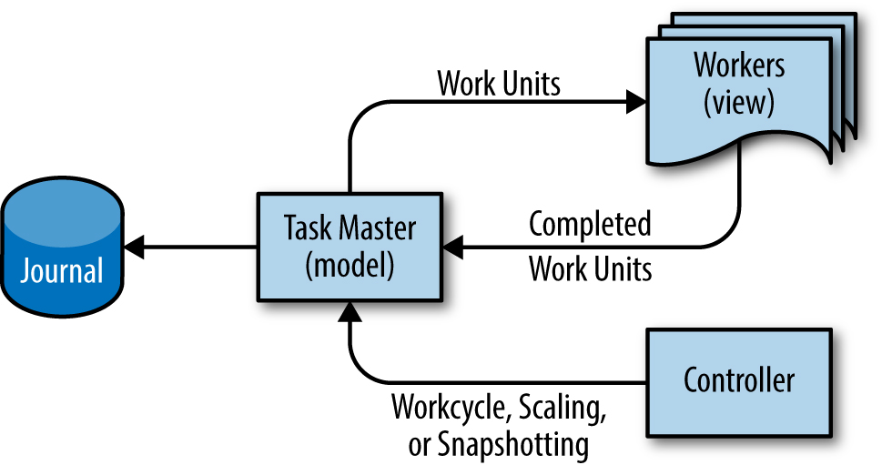
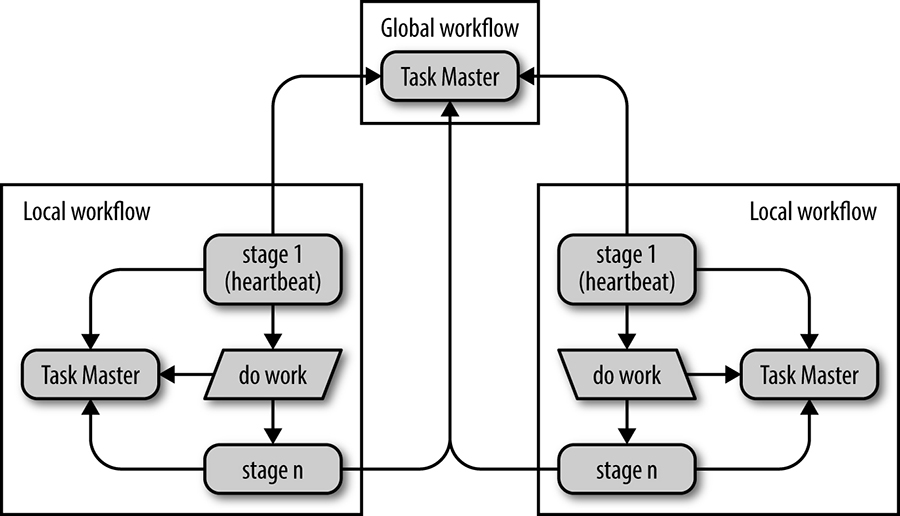

# Data Processing Pipelines
데이터 처리 파이프라인을 관리 할 때 발생하는 문제에 대해서 다룬다.

## Origin of the Pipeline Design Pattern
cron 과 같은 시스템에 의해서 주기적으로 실행되는 데이터를 읽고 변환해서 새로운 데이터를 출력하는 프로그램을 데이터 파이프라인 이라고 부른다.
빅데이터가 등장하면서 데이터 파이프라인이 다시 주목을 받게 되었다.

## Initial Effect of Big Data on the Simple Pipeline Pattern
one-phase pipeline 는 빅데이터에 대해서 정기적 또는 계속적으로 데이터를 처리하는 프로그램을 말한다.
multiphase pipeline 는 한 프로그램의 출력이 다시 다른 프로그램의 입력이 되도록 구성된 프로그램을 말한다.
빅데이터의 복잡성을 고려할 때, 추론을 용이하게 위해서 이러한 연속된 배결로 프로그램을 구성한다.
직렬로 연결된 프로그램의 수를 파이프라인의 depth 라고 한다.

## Challenges with the Periodic Pipeline Pattern
주기적 파이프라인을 컴퓨팅 리소스가 충분할 때는 문제없이 잘 동작한다. 
유기적인 성장과 변경으로 인해초기에 잘 동작하던 주기적 파이프라인은 문제를 발생시킨다.

## Trouble Caused By Uneven Work Distribution
빅데이터 처리의 주요 돌파구는 많은 분량을 각각의 머신으로 병렬로 처리하는 것 이다.
어떤 chunks 는 다른 것 보다 더 많은 리소스를 필요로 하는데 이것을 처음부터 명백하게 알기는 쉽지 않다.
정렬같은 작업은 분산 처리를 하더라도 전체를 취합해야 하기 때문에, 가장 느린 처리가 완료될 때 까지 기다려야 한다. 
이러한 문제를 hanging chunk 라고 한다.

만약 엔지너어가 모니터링으로 이런 문제를 감지 했을 때, 작업을 정지한 다음 다시 시작하도록 하는 것은 문제를 악화 시킬 수 있다.
hanging 은 비 결정적 요인에 대한 결과 일 수 있음으로 이런 시도는 합리적인 대응이라 할 수 있지만 
보통 파이프라인에는 체크포인트가 없음으로 다시 모든 작업을 다시 시작해야 함으로 컴퓨팅 리소스가 낭비된다.

## Drawbacks of Periodic Pipelines in Distributed Environments
주기적 파이프라인은 컴퓨팅 리소스를 효율적으로 사용하기 위해서 우선순위가 낮은 배치 작업으로 실행된다. 
이를 위한 별도의 스케쥴링 메카니즘이 있고 이는 시작에 지연을 유발하고 우선위가 밀려서 무기한으로 연기될 수도 있다. 
그렇다고 이 작업의 우선순위를 높이면 리소스를 효율적으로 사용할 수 없게 되기 때문에 균형을 유지해야한다.

지연시간이 스케쥴링간격보다 커지게 되면 이미 프로세스가 진행중인데 다음 작업이 스택에 쌓이거나, 
최악의 경우 진행중이 프로세스가 거의 완료되었음에도 그대로 종료되는등의 바람직하지 못한 동작을 하게 된다.
이러한 문제를 해결하기 위해서는 충분한 처리용량을 확보하고, 배치 스케쥴링 리소스와 프러덕션 우선순위 리소스를 구분하고 이를 확보하는 비용을 합리화 해야 한다.

### Monitoring Problems in Periodic Pipelines
실행시간이 긴 파이프라인의 경우, 런타임에 실시간으로 제공되는 성능 메트릭이 중요할 수 있다.
이런 메트릭은 장애에 대한 반응이나 운영에 제공될 수있다.
실행이 완료되는 시점에서 제공되는 메트릭은 만약 실행이 실패한다면 아무런 메트릭도 얻을 수 없다.

계속적인 파이프라인은 리얼타임 메트릭을 사용할 수 있도록 설계되어있기 때문에 이러한 문제를 가지지 않는다.

### "Thundering Herd" Problems (몰아침 문제)
주기적으로 실행되는 파이프라인은 그 수가 많아지면서, 비슷한 타이밍에 시작될 수 있다.
비슷한 타이밍의 많은 수의 worker의 사용은 과부하를 유발할 수 있다.
제대로 구현되지 않은 재시도 로직이나, 단순히 파이프라인에 worker 를 추가하려는 시도 또한 이 문제를 악화시킬 수 있다.

### Moiré Load Pattern
시작시간이 같지 않아도 주기에 의해 실행 타이밍이 겹쳐서 부하가 증가할 수 있다. 이러한 패턴은 모니터링 그래프로 식별 할 수 있다. 
이렇게 별도의 파이프라인에서 실행 시퀸스가 우연히 겹쳐서 리소스를 과도하게 사용하는 패턴을 모아레 부하 패턴이라고 한다.

## Introduction to Google Workflow
단발성 배치작업은 비지니스 요구사항을 충족시키며 연속적인 파이프라인으로 발전한다.
이때 확장문제에 대한 해결책, 새로운 기능등이 요구되면서 연속적인 파이프라인으로의 설계 리팩터링은 더욱 어려운 일이 된다.
구글은 이려한 요구에 대한 해결책으로 Workflow 라는 시스템을 개발했다.
Workflow 는 큰 규모의 transactional data pipeline 을 가능하게 하고 "한번 실행"의 의미론으로 정확성을 보장한다.

_The model-view-controller design pattern as adapted for Google Workflow_  

_An example of distributed data and process flow using Workflow pipelines_  

_※prevalence: 확산_
### Workflow as Model-View-Controller Pattern
Workflow MVC 이디엄을 차용했다. model 과 view 는 정보의 다른 표현을 가지도록 분리되어 있고 view 는 model 을 관찰한다. 
model 에 대응하는 것은 TaskMaster 다.
TaskMaster 는 모든 job 의 state 를 가지고 있다.
view 에 대응하는 것은 복수의 Worker 들 이다.
Worker 들은 파이프라인의 하위 구성요소로 계산을 수행하고, TaskMaster 트랜잭션방식으로 통신하고, 
TaskMaster 에 의해 시스템의 상태가 업데이트되게 된다. 
controller 는 파이프라인 런타임의 확장, 스냅샷, 파이프라인 state 의 롤백 등, 보조 활동을 지원한다.

## Stages of Execution in Workflow
TaskMaster 는 여러 작업 그룹을 가질 수 있고, 이 작업 그룹들의 단계가 파이프라인의 depth 가 된다.
그리고 각각의 작업 그룹은 파이프라인의 stage 에 해당한다.
여러 stage 에 걸쳐서 처리가 완료될 수 있다. 

### Workflow Correctness Guarantees
worker 들은 lease 를 통해 처리할 work 를 얻기 때문에 정확성이 보장된다.
이와 더불어 Workflow 는 각 작업의 버전도 관리한다.

## Ensuring Business Continuity (비지니스 연속성을 보장하기위한 설계, 어떻게 reliability 를 증진시키는지)
재해로 인해 일부 데이터센터가 기능하지 않아도 빅데이터 파이프라인이 동작 할 수 있도록 workflow 는 전세계적인 분산환경에서도 일관성을 보장하는 아키텍쳐를 도입했다.
Chubby 분산 락 시스템으로 Task Master 를 선출해 Spanner 파일 시스템에 결정 결과를 기록한다. 
(Chubby 와 Spanner 시스템을 활용함으로 Global workflow 의 task master 단일 장애지점이 될 수 없다.)
Global workflow 와 복수의 Local workflow 로 구성되어서 stage1 이라는 바이너리가 controller 역할을 한다.
stage1 은 참조 태스크 작성하고, 하트비트 태스크를 Global workflow에 주기적으로 업데이트 한다.
일정한 시간내에 하트비트 테스크가 업데이트 되지 않으면 자동적인 failover 가 이루어 지는데,
이는 다른 Local workflow 가 작성된 참조 태스크를 이어받아서 처리하는 것 이다.
이러한 메카니즘을 통해 단일 장애 지점을 제거하고 데이터 센터의 장애에도 비지니스 연속성을 유지할 수 있다.  

## Summary and Concluding Remarks (요약 및 맺음말)
periodic pipelines 유용하지만 단점(보통 실시간으로 성능 메트릭을 알 수 있도록 설계되어있지 않다는점, 부하가 특정 시간대에 겹치는 패턴이 나타난다는점) 도 있다.
특정 간격마다 데이터를 일괄 처리하는 periodic pipelines 가 시간이 지남에 따라서 유기적으로 증가가 지속되는경우, 실시간으로 데이터를 처리하는 continuous pipelines 으로 변경해야 할 수 있다.
구글은 이 공통 관심사에 대한 해결책으로 workflow 라는 시스템을 도입했다.
workflow 는 mvc 이디엄을 차용해서 성능이 우수하고 확장이 용이하고, 단일 장애지점이 없는 시스템으로 설계되었다.